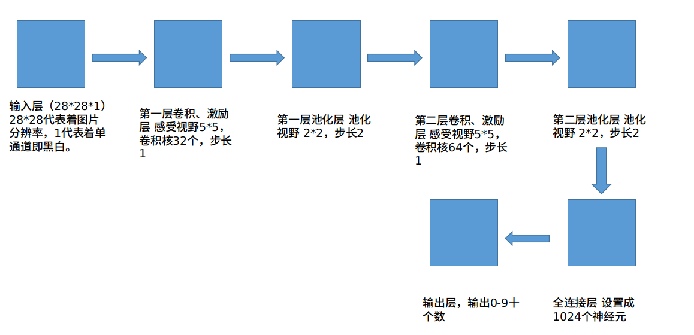
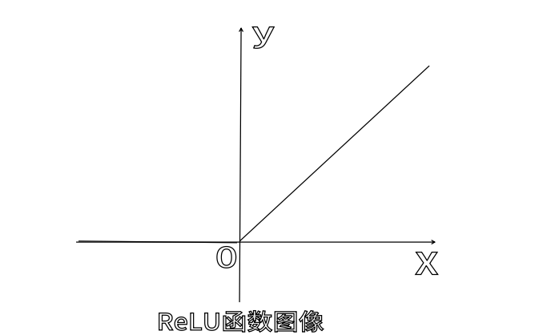

# 一、CNN模型的构建



​	卷积主要是用一个核（即一个矩阵）和图片相乘，即相当于对图片进行低通道滤波。当对一个图片卷积时，在特定的曲线和曲线周边的区域会得到一个比较高的值，在其他的区域会得到一个比较低的值。

​	激励层主要是对卷积层的输出进行一个非线性映射，本模型使用的是线性整流函数（ReLU）。



使用ReLU函数的理由：

1、从图像上可以看出ReLU函数图像形式简单，它的导数同样不复杂形式简单，所以，这就可以使得网络的训练更加的快速。

2、ReLU函数本身就是非线性函数，加入到神经网络当中可以使得网络拟合非线性映射。

3、ReLU函数为非饱和激活函数不会出现梯度消失的情况。

4、可以减少过拟合。

​	池化层主要是用来进行降维操作。卷积核很小时，一般得到的下层神经元矩阵较大，所以需要池化层来降维。而最大池化（Max pooling）将入的图像划分为若干个矩形区域，对每个子区域输出最大值。它是在发现一个特征之后，它的精确位置远不及它和其他特征的相对位置的关系重要。池化层会不断地减小数据的空间大小，因此参数的数量和计算量也会下降，这在一定程度上也控制了过拟合。

# 二、模型的创建过程

## （1）导库

```python
import tensorflow as tf
from tensorflow.examples.tutorials.mnist import input_data
```

tensorflow对Mnist数据集进行了封装，使用tensorflow更加的方便。

## （2）加载Mnist数据集

```python
mnist=input_data.read_data_sets('F:/Mnist/data_set',one_hot=True)
```

这里使用本地下载好的数据集，当然，如果本地没有这个数据集他会自动下载、读入数据集。

独热编码是使用N位状态寄存器来对N个状态进行编码，每个状态都由他独立的寄存器位，并且在任意时候，其中只有一位有效。在本模型中，one-hot是1000000000,0100000000,0010000000,0001000000,0000100000,0000010000,0000001000,0000000100,0000000010,0000000001。并且，这些特征互斥，每次只激活一个。所以，用独热编码数据就会变成稀疏的。

Mnist数据集的内容：

60000个训练样本，其中55000个用于训练，5000个用于验证

10000个测试样本

## （3）卷积层的定义

```Python
def conv2d(input,filter):
    return tf.nn.conv2d(input,filter,strides=[1,1,1,1],padding='SAME')
```

输入格式：data_format，默认为”NHWC“

输入：input，输入是一个4维的数据，数据的shape表示为：[batch,in_channels,in_height,in_width]分别表示图片数量、图片通道数、图片高度和图片宽度

卷积核：filter，卷积核是一个4维的数据，数据的shape表示为：[height,width,in_channels, out_channels]分别表示卷积核的高、宽、深度、输出的下层神经元矩阵（feature map）个数。

步长：strides，一个长度为4的一维列表，每一个元素都与输入的格式对应，表示在输入格式的每一维的移动的步长。其中数据的shape为[batch , in_height , in_width, in_channels]分别表示在多少个样本上移动、卷积核在特征图的高度上移动的步长、积核在特征图的宽度上移动的步长、在多少个通道上移动。batch和in_channels默认为1，即只能在一个样本的一个通道的特征图上移动。

填充方式：padding，”SAME“表示以0填充边缘，”VALID“表示不采用填充方式，多余的进行抛弃，stride为1时，表示输出和输出的维度相同。

## （4）池化层的定义

```python
def max_pool_2x2(value):
    return tf.nn.max_pool(value,ksize=[1,2,2,1],strides=[1,2,2,1],padding='SAME')
```

池化的输入：value，一个4维格式的数据，数据的shape表示为[batch,height,width,channels]。

池化窗口的大小：ksize，一个长度为4的一维列表，一般为[1,height,width,1]。

填充方式：padding，”SAME“表示以0填充边缘，”VALID“表示不采用填充方式，多余的进行抛弃，stride为1时，表示输出和输出的维度相同。

## （5）输入层

```python
x=tf.placeholder(tf.float32,[None,784]) 
y=tf.placeholder(tf.float32,[None,10])
x_image=tf.reshape(x,[-1,28,28,1])
```

x表示输入图片，它是一个2维的浮点数张量。None表示其值的大小不定，用来指代batch的大小，每一批训练的图片的数量不确定。784表示一张Mnist图片的维度（28*28）。

y表示输出类别值，它也是一个2维的浮点数张量。10表示10维的独热编码向量，用来表示对应的Mnist图片的类别（0-9）。

x_image表示改变x的格式为4维的向量

## （6）第一层卷积

```Python
W_conv1=weight_variable([5,5,1,32])
b_conv1=bias_variable([32])
h_conv1=tf.nn.relu(conv2d(x_image,W_conv1)+b_conv1)
h_pool1=max_pool_2x2(h_conv1)
```

这一层是由一个卷积和一个最大池组成。卷积在每个5*5的区块中算出32个特征。前两个5代表区块的大小,1表示有一个输入通道，32表示输出的通过数目。

b_conv1表示输出通道对应的偏置量。

h_conv1表示应用ReLU激活函数池化。

h_pool1表示使用max_pool_2x2函数将图像变成14*14。

## （7）第二层卷积

```Python
W_conv2=weight_variable([5,5,32,64]) 
b_conv2=bias_variable([64])
h_conv2=tf.nn.relu(conv2d(h_pool1,W_conv2)+b_conv2)
h_pool2=max_pool_2x2(h_conv2) 
```

由于把几个类似的层堆叠在一起，所有，在第二层，每个5*5的区块会得到64个特征。其他的相当于第一层很类似。

## （8）全连接层

```Python
W_fc1=weight_variable([7*7*64,1024])
b_fc1 = bias_variable([1024])
h_pool2_flat = tf.reshape(h_pool2,[-1,7*7*64])
h_fc1=tf.nn.relu(tf.matmul(h_pool2_flat,W_fc1)+b_fc1)
```

经过第二层的池化，图片的尺寸减少为7*7，通过加入一个1024个神经元的全连接层处理图片，可以更有效的进行分类。然后把池化层输出的张量转换成向量，对其使用ReLU函数计算结果。

## （9）输出层

```python
W_fc2=weight_variable([1024,10])
b_fc2=bias_variable([10])
prediction=tf.nn.softmax(tf.matmul(h_fc1_drop,W_fc2)+b_fc2)
cross_entropy=tf.reduce_mean(tf.nn.softmax_cross_entropy_with_logits(labels=y,logits=prediction))
```

输出值一般都是通过目标真实结果与应用于模型预测的softmax激活函数之间的交叉熵。交叉熵代价函数一般可以提高训练速度。

## （10）训练评估模型

```python
train_step=tf.train.AdamOptimizer(1e-4).minimize(cross_entropy)
correct_prediction=tf.equal(tf.argmax(prediction,1),tf.argmax(y,1))
accuracy=tf.reduce_mean(tf.cast(correct_prediction,tf.float32))
with tf.Session() as sess:
    start_time=time.clock()
    sess.run(tf.global_variables_initializer())
    for epoch in range(26):  
        for batch in range(n_batch):
            batch_xs,batch_ys=mnist.train.next_batch(batch_size)
            sess.run(train_step,feed_dict={x:batch_xs,y:batch_ys,keep_prob:0.7}) 
        acc=sess.run(accuracy,feed_dict={x:mnist.test.images,y:mnist.test.labels,keep_prob:1.0})
```

​	使用AdamOptimizer进行优化。Adam算法是一种计算每个参数的自适应学习率的方法，相当于RMSprop + Momentum。除了像RMSprop存储了过去梯度平方vt的指数衰减平均值，也像momentum一样保持了过去梯度mt的指数衰减平均值。一般默认学习率为0.0001。

​	在feed_dict中加入参数keep_prob来控制dropout的比例，用来减少过拟合。

# 三、测试

```python
h_feature = tf.reshape(h_drop3,[-1,w4.get_shape().as_list()[0]])
h_f = tf.nn.dropout(h_feature,p_keep_conv)
h_fc1 = tf.nn.relu(tf.matmul(h_f,w4))
h_fc2 = tf.nn.dropout(h_fc1,p_keep_hidden)
```


# 四、总结


